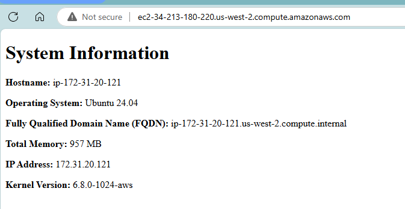
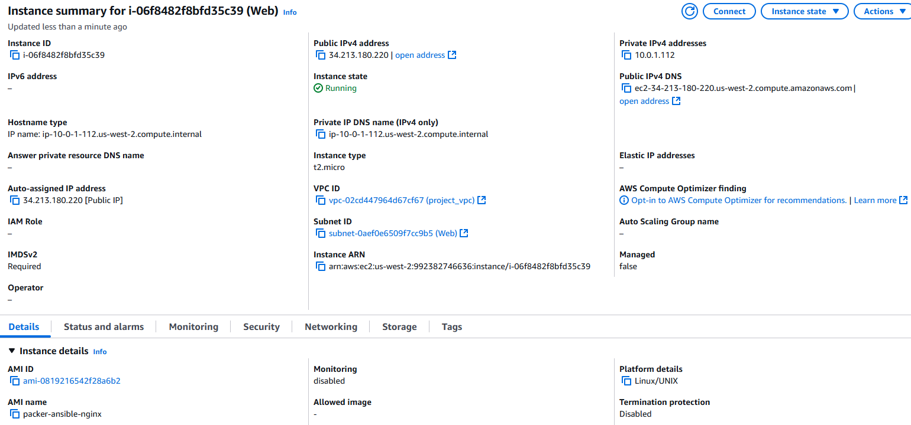

# 4640-w9-lab-start-w25

## To deploy the AWS EC2 instance using the custom Nginx configurations, run the following commands for quick deployment:
Note: Ensure you are in the root directory of the project when running these commands (in this case: "4640-w9-lab-start-w25")
1. Generate ssh keys
> ssh-keygen -t ed25519 -f ~/.ssh/<name_of_key>
2. Import public key to AWS
> sh ./scripts/import_lab_key ~/.ssh/<name_of_key>.pub
3. Build the AMI
> packer init packer/

> packer build packer/
4. Create the EC2 instances
- change directory to the terraform file (main.tf)
> cd terraform

Then enter the following:
> terraform init

> terraform apply
5. At the end of the terraform execution information, you should receive a dns name and an ip address. Use either one to go to the website:

## Troubleshooting
In case you run into some issues, run the following:
1. If your packer file did not build the AMI, enter the command below to see the error info:
> packer validate packer/

Then fix the formatting of the packer .hcl file
> packer fmt packer/

Then build the AMI again using the commands from step 3 above

2. If your EC2 instances did not get created, enter the command below to see the error (make sure you're in the proper directory):
> terraform validate

> terraform fmt

Then create the instances again with step 4

EC2 Instance created:
